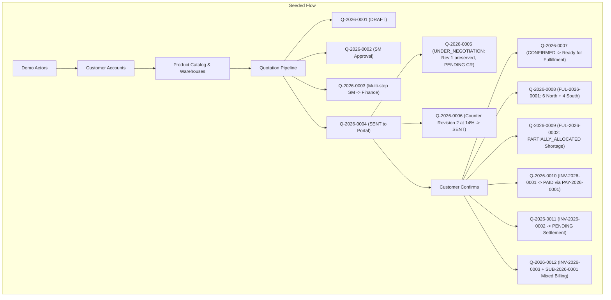

# DealFlow360 Demo & Development Mock Data

This document describes the comprehensive development and demonstration dataset seeded into DealFlow360.
The dataset is specifically structured to showcase the end-to-end commercial operations platform across all user roles, customer tiers, approval chains, negotiation iterations, multi-warehouse fulfillment, and billing models.

---

## 1. How to Run the Seed

### Standard Non-Destructive Seed
Keyed by stable identifiers and find-or-create semantics. It is **100% idempotent** and safe to run multiple times without duplicating data or corrupting existing records:

```bash
npm run seed
# or
npx tsx scripts/demo/index.ts
# or
npx prisma db seed
```

### Clean Re-Seed (Opt-In)
Purges only records belonging to the `dealflow-demo` tenant and regenerates fresh lifecycle transitions through the domain engine:

```bash
npm run seed:clean
# or
npx tsx scripts/demo/index.ts --clean
```

---

## 2. Demo Organization & Credentials

| Organization Name | Organization Identifier (Slug) |
| :--- | :--- |
| **DealFlow360 Demo Corp** | `dealflow-demo` |

> [!NOTE]
> All demo accounts share the standard development password: **`DemoPassword123!`**

### Internal User Accounts

| Role | Name | Email | Password | Workspaces & Capabilities |
| :--- | :--- | :--- | :--- | :--- |
| **`ADMIN`** | Demo Admin | `admin@dealflow.demo` | `DemoPassword123!` | System configuration, governance, user admin, multi-facility overrides |
| **`SALES_MANAGER`** | Demo Sales Manager | `manager@dealflow.demo` | `DemoPassword123!` | `/approvals` inbox, discount approvals up to 20%, customer approvals |
| **`SALES_REP`** | Demo Sales Rep | `rep@dealflow.demo` | `DemoPassword123!` | `/quotations` pipeline, draft builder, price recalculation, customer counters |
| **`FINANCE_OPERATIONS`** | Demo Finance | `finance@dealflow.demo` | `DemoPassword123!` | `/approvals` (Level 2), `/fulfillment` queue, `/billing` invoicing and settlement |

### Customer Portal Accounts

Customer users were created via the canonical customer domain service (`customerService.createCustomer`):

| Customer Tier | Company Name | Email | Password | Discount Governance Ceiling |
| :--- | :--- | :--- | :--- | :--- |
| **`BRONZE`** | Acme Retailers (Bronze) | `customer.bronze@dealflow.demo` | `DemoPassword123!` | Max 10% discount |
| **`SILVER`** | Apex Solutions (Silver) | `customer.silver@dealflow.demo` | `DemoPassword123!` | Max 20% discount |
| **`GOLD`** | Global Enterprise Corp (Gold) | `customer.gold@dealflow.demo` | `DemoPassword123!` | Max 30% discount |

---

## 3. Product Catalog

| Product Name | Category | Billing Type | Billing Interval | Variants / SKU | Base Price | Cost Price |
| :--- | :--- | :--- | :--- | :--- | :--- | :--- |
| **Enterprise Edge Server Pro** | Hardware | ONE_TIME | — | `SRV-16C-64G` (16-Core 64GB)<br>`SRV-32C-128G` (32-Core 128GB) | $3,200.00<br>$5,500.00 | $1,900.00<br>$3,200.00 |
| **Industrial Managed Switch 24P** | Hardware | ONE_TIME | — | *Directly sellable (No variants)* | $1,200.00 | $750.00 |
| **Deployment & Integration Consulting** | Services | ONE_TIME | — | *Directly sellable (No variants)* | $2,500.00 | $1,000.00 |
| **Cloud Fleet Management Suite** | Subscriptions | RECURRING | MONTHLY | `SUB-FLEET-STD` (Up to 50 Devices)<br>`SUB-FLEET-ENT` (Unlimited Devices) | $250.00/mo<br>$650.00/mo | $50.00/mo<br>$120.00/mo |
| **24/7 Mission Critical Support SLA** | Subscriptions | RECURRING | YEARLY | *Directly sellable (No variants)* | $4,800.00/yr | $1,200.00/yr |

### Discount Governance Ceilings & Policies

- **Customer Tier Ceilings:** Gold: 30% \| Silver: 20% \| Bronze: 10%
- **Product Category Ceilings:** Services: 30% \| Hardware: 25% \| Subscriptions: 20%
- **Approval Threshold Routing:**
  - $\le 10\%$: Within Limit (Auto-approved)
  - $> 10\%$ and $\le 20\%$: Sales Manager Approval Required
  - $> 20\%$: Sequential Approval Required (`SALES_MANAGER` $\rightarrow$ `FINANCE_OPERATIONS`)

---

## 4. Warehouses & Stock Allocation Strategy

| Code | Facility Name | Priority | Status | Available Stock Setup |
| :--- | :--- | :---: | :---: | :--- |
| **`WH-NORTH`** | Northern Logistics Center | **1** | Active | `SRV-16C-64G`: 6 units \| `Switch 24P`: 0 units |
| **`WH-SOUTH`** | Southern Regional Hub | **2** | Active | `SRV-16C-64G`: 10 units \| `Switch 24P`: 2 units |
| **`WH-EAST`** | Eastern Distribution Depot | **3** | Active | `SRV-16C-64G`: 15 units \| `Switch 24P`: 1 unit |

---

## 5. Quotation Lifecycle Demonstration Matrix

All quotation numbers (`quoteNumber`) are generated sequentially by the system. Below is the mapping of scenarios to their generated identifiers:

| Scenario Reference | Quote # | Lifecycle Stage | Customer | Active Revision | Highlighted Features & Workspace Demo |
| :--- | :--- | :--- | :--- | :---: | :--- |
| **`DEMO-QUOTE-DRAFT`** | `Q-2026-0001` | `DRAFT` | Acme Retailers (Bronze) | Rev 1 | **Quotation Builder (`/quotations/[id]`):** In-progress deal with line-level recalculations and pricing draft. |
| **`DEMO-QUOTE-SM-APPROVAL`** | `Q-2026-0002` | `PENDING_APPROVAL` | Apex Solutions (Silver) | Rev 1 | **Sales Manager Approval (`/approvals`):** Line discount is 15% (crosses 10% SM threshold; within 20% Silver cap). Exhibits single-step approval. |
| **`DEMO-QUOTE-MULTI-APPROVAL`** | `Q-2026-0003` | `PENDING_APPROVAL` | Global Enterprise (Gold) | Rev 1 | **Sequential Approval Chain (`/approvals`):** Line discount is 25% (crosses 20% Finance threshold; within 30% Gold cap). Shows sequential chain: Sales Manager $\rightarrow$ Finance Operations. |
| **`DEMO-QUOTE-PORTAL-SENT`** | `Q-2026-0004` | `SENT` | Global Enterprise (Gold) | Rev 1 | **Customer Portal Review (`/portal/quotations`):** 8% discount was auto-approved and delivered to the customer for review. |
| **`DEMO-QUOTE-NEGOTIATION-PENDING`** | `Q-2026-0005` | `UNDER_NEGOTIATION` | Global Enterprise (Gold) | Rev 1 | **Customer Change Request (`/quotations/[id]` & Portal):** Active revision remains at 15% discount. Customer's 18% request is recorded as a `PENDING` ChangeRequest without premature mutation. |
| **`DEMO-QUOTE-NEGOTIATION-COUNTER`** | `Q-2026-0006` | `SENT` | Apex Solutions (Silver) | **Rev 2** | **Negotiation Execution & Revision 2:** Customer requested 17%; Sales counter-proposed 14% via `negotiationExecutionService.executeIntent`, creating authoritative Revision 2 approved and delivered. |
| **`DEMO-QUOTE-READY-FULFILL`** | `Q-2026-0007` | `CONFIRMED` | Global Enterprise (Gold) | Rev 1 | **Ready For Fulfillment (`/fulfillment` queue):** 10 units confirmed; shows "Create Fulfillment" button ready for live execution. |
| **`DEMO-QUOTE-FULFILLMENT`** | `Q-2026-0008` | `CONFIRMED` | Apex Solutions (Silver) | Rev 1 | **Multi-Warehouse Allocation Split (`/fulfillment/[id]`):** Fulfillment `FUL-2026-0001` splits 10 units into 6 from `WH-NORTH` (Priority 1) + 4 from `WH-SOUTH` (Priority 2). |
| **`DEMO-QUOTE-FULFILLMENT-SHORTAGE`** | `Q-2026-0009` | `CONFIRMED` | Acme Retailers (Bronze) | Rev 1 | **Shortage State (`/fulfillment/[id]`):** Fulfillment `FUL-2026-0002` for 5 units Switch 24P allocates all 3 available across warehouses; status is `PARTIALLY_ALLOCATED`. |
| **`DEMO-QUOTE-PAID`** | `Q-2026-0010` | `CONFIRMED` | Acme Retailers (Bronze) | Rev 1 | **Paid Settlement (`/billing` & `/invoices/[id]`):** Invoice `INV-2026-0001` settled with authoritative payment record `PAY-2026-0001` ($4,900.00). |
| **`DEMO-QUOTE-BILLING-PENDING`** | `Q-2026-0011` | `CONFIRMED` | Apex Solutions (Silver) | Rev 1 | **Pending Settlement (`/billing`):** Invoice `INV-2026-0002` in `PENDING` status ($1,200.00); ready to test the "Pay Invoice" action. |
| **`DEMO-QUOTE-MIXED`** | `Q-2026-0012` | `CONFIRMED` | Global Enterprise (Gold) | Rev 1 | **Multi-Model Billing (`/billing` & `/subscriptions`):** Simultaneously created Invoice `INV-2026-0003` ($3,200 hardware) and active recurring Subscription `SUB-2026-0001` ($1,300/mo). |

---

## 6. Lifecycle Flow Map



---

## 7. Architectural Integrity & Safety

- **No Status Manufacturing:** No statuses or records were faked by directly writing synthetic database rows. Quotations, revisions, change requests, approvals, fulfillment allocations, invoices, and payments were all created through the real application domain services.
- **Actor Authorization:** Transitions were executed with the explicit session context of the responsible actor (`salesRep` creates/submits, `salesManager` approves, `finance` approves, `customer` negotiates/confirms).
- **Tenant Isolation:** Scoped strictly to `dealflow-demo`. Production and non-demo tenants are never affected.
